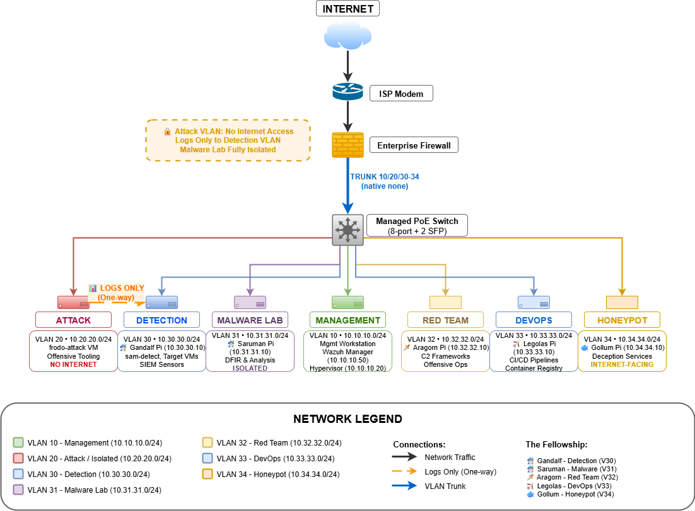

# 🛡️ Purple Lab - Enterprise SOC Infrastructure

> Production-style purple team lab with segmented VLANs, Wazuh SIEM, real attacks, and real detections.

**📖 New to this?** Read the [simplified concept overview on Medium](#) first, then dive into the full implementation here.

---

## 🏗️ What This Is

A battle-tested SOC lab featuring:
- **5 VLAN-segmented Raspberry Pis** (Fellowship-themed: Gandalf, Saruman, Aragorn, Legolas, Gollum)
- **Enterprise Firewall** with strict inter-VLAN rules
- **Type-1 Hypervisor** with attack VMs and targets
- **Wazuh SIEM** with working detection rules
- **Real vulnerable applications** and C2 frameworks
- **PowerShell automation** for Pi management

---

## 🚀 Quick Start

```powershell
git clone https://github.com/Keith-M-work/purple-lab.git
cd purple-lab

# Test connectivity to Wazuh
Test-NetConnection 10.10.10.50 -Port 443    # Wazuh dashboard
Test-NetConnection 10.10.10.50 -Port 1515   # Agent enrollment
```

---

## 🌐 Network Architecture

### VLAN Layout

| VLAN | Name | Subnet | Gateway | Purpose |
|------|------|--------|---------|---------|
| **10** | Management | 10.10.10.0/24 | 10.10.10.1 | Admin, Hypervisor, Wazuh manager |
| **20** | Attack | 10.20.20.0/24 | 10.20.20.1 | frodo-attack VM, C2 staging (no internet by default) |
| **30** | Detection | 10.30.30.0/24 | 10.30.30.1 | SIEM sensors, target VMs, Gandalf Pi |
| **31** | Malware Lab | 10.31.31.0/24 | 10.31.31.1 | Saruman Pi - malware analysis, DFIR |
| **32** | Red Team | 10.32.32.0/24 | 10.32.32.1 | Aragorn Pi - offensive tools, C2 relay |
| **33** | DevOps | 10.33.33.0/24 | 10.33.33.1 | Legolas Pi - CI/CD, container registry |
| **34** | Honeypot | 10.34.34.0/24 | 10.34.34.1 | Gollum Pi - deception services (internet-facing) |

### Physical Topology

```
┌─────────────┐
│  INTERNET   │
└─────┬───────┘
      │ (WAN)
┌─────┴──────────────────────────────────────────┐
│      Enterprise Firewall Appliance             │
│  WAN: DHCP from ISP                            │
│  LAN: 10.10.10.1/24    (VLAN 10 • Management)  │
│  OPT1: 10.20.20.1/24   (VLAN 20 • Attack)      │
│  OPT2: 10.30.30.1/24   (VLAN 30 • Detection)   │
│  OPT3: 10.31.31.1/24   (VLAN 31 • Malware)     │
│  OPT4: 10.32.32.1/24   (VLAN 32 • Red Team)    │
│  OPT5: 10.33.33.1/24   (VLAN 33 • DevOps)      │
│  OPT6: 10.34.34.1/24   (VLAN 34 • Honeypot)    │
└───────────────┬────────────────────────────────┘
                │ TRUNK (VLANs 10,20,30-34)
                │
┌───────────────┴──────────────────────────────────┐
│  Managed PoE Switch (8-port + 2 SFP)            │
│  Switch Management IP: 10.10.10.2                │
│  [Port 1]  Empty                                 │
│  [Port 2]  Management Workstation (VLAN 10)     │
│  [Port 3]  Gandalf Pi (VLAN 30) → 10.30.30.10   │
│  [Port 4]  Saruman Pi (VLAN 31) → 10.31.31.10   │
│  [Port 5]  Aragorn Pi (VLAN 32) → 10.32.32.10   │
│  [Port 6]  Legolas Pi (VLAN 33) → 10.33.33.10   │
│  [Port 7]  Gollum Pi (VLAN 34) → 10.34.34.10    │
│  [Port 8]  Legacy Router (logging/isolated)     │
│  [SFP 1]   Hypervisor Host (TRUNK) → 10.10.10.20│
│  [SFP 2]   Firewall Trunk                       │
└──────────────────────────────────────────────────┘
```

### Key Infrastructure

**Hypervisor Host (Compact Server - 10.10.10.20)**
- VLAN-aware bridge on SFP1
- VMs:
  - `frodo-attack` (VLAN 20) → 10.20.20.50 - Offensive tooling
  - `sam-detect` (VLAN 30) → 10.30.30.50 - Detection sensor
  - `pippin-util` (VLAN 30) → 10.30.30.52 - Utilities
  - `merry-endpoint` (VLAN 30) → 10.30.30.53 - Endpoint testbed

**Management Workstation (VLAN 10 - 10.10.10.100)**
- Linux subsystem + Container runtime
- Wazuh single-node stack:
  - Manager: 10.10.10.50
  - Dashboard: `https://10.10.10.50:443`
  - Indexer: 10.10.10.50:9200
- Switch management interface
- PowerShell lab automation functions

---

## 🧙 The Fellowship (Raspberry Pis)

### 🧙‍♂️ Gandalf Pi (VLAN 30 - Detection)
**IP:** 10.30.30.10  
**Role:** Blue team sensor & log collection
- Wazuh agent (telemetry to manager)
- Log forwarding agents (syslog, file monitoring)
- Container runtime + lightweight orchestration
- Optional: Network monitoring (with mirrored traffic)

### 🧙‍♂️ Saruman Pi (VLAN 31 - Malware Analysis)
**IP:** 10.31.31.10  
**Role:** DFIR & reverse engineering
- YARA signature scanning
- Disassembly and analysis tools
- Binary inspection utilities
- Isolated malware execution environment

### 🗡️ Aragorn Pi (VLAN 32 - Red Team)
**IP:** 10.32.32.10  
**Role:** Offensive utilities & C2 relay
- Attack simulation frameworks
- Network reconnaissance tools
- Command and control redirectors
- Container runtime

### 🏹 Legolas Pi (VLAN 33 - DevOps)
**IP:** 10.33.33.10  
**Role:** CI/CD & container registry
- Container runtime and orchestration
- CI/CD pipeline runners
- Private container registry
- Security testing integration

### 🐟 Gollum Pi (VLAN 34 - Honeypot)
**IP:** 10.34.34.10  
**Role:** Internet-facing deception (WiFi-enabled)
- Low-interaction honeypot services
- Fake SSH/Telnet endpoints
- Deceptive network services
- Full internet exposure (monitored)

---

## 🔒 Security Zones & Rules

### Egress Control (Firewall)

| VLAN | Internet Access | Notes |
|------|----------------|-------|
| **10** (Management) | ✅ Full | Admin workstation, updates |
| **20** (Attack) | ❌ Blocked | Allowlist only for repos/tools |
| **30** (Detection) | ✅ Limited | Agent traffic to SIEM only |
| **31** (Malware) | ❌ Blocked | Only signature updates via proxy |
| **32** (Red Team) | ⚠️ Controlled | Allowlist for specific exercises |
| **33** (DevOps) | ✅ Limited | Registries, CI traffic only |
| **34** (Honeypot) | ✅ Full | Inbound from internet (monitored) |

### Inter-VLAN Rules

- **All VLANs → VLAN 10 (Wazuh):** Ports 1514/1515/443 allowed
- **VLAN 10 → All VLANs:** Admin SSH/RDP allowed
- **VLAN 20 → VLAN 30:** Attack to targets only during exercises
- **VLAN 31 ↔ Others:** Isolated (malware containment)
- **Default:** Deny all inter-VLAN unless explicitly allowed

---

## 🛠️ Critical Issues We Fixed

### 1. Port 9220 vs 9200
Docker uses port **9200**, not 9220:
```powershell
$Global:WazuhConfig = @{ IndexerPort = 9200 }
```

### 2. Groups in Agent Config
Groups belong server-side only - remove from agent:
```bash
sudo sed -i '/<groups>/d' /var/ossec/etc/ossec.conf
sudo systemctl restart wazuh-agent
```

### 3. Inter-VLAN Firewall Rules
Each VLAN needs explicit firewall rules to Wazuh:
- **TCP 1515** (agent enrollment)
- **UDP 1514** (event logging)
- **TCP 443** (dashboard access)

### 4. VLAN-Aware Bridge
Hypervisor needs VLAN filtering enabled on trunk interface:
```bash
# Enable VLAN filtering on bridge interface
ip link set <bridge_interface> type bridge vlan_filtering 1
```

---

## 📁 Repository Structure

```
purple-lab/
├── assets/
│   └── network-diagram-detailed.png    # Full topology diagram
├── core-infra/
│   ├── config/                         # Lab configuration files
│   └── scripts/                        # Pi bootstrap, automation
├── lab-apps/
│   └── vuln-apps/                      # DVWA, Juice Shop, etc.
├── sec-ops/
│   ├── blue-team/                      # Incident response playbooks
│   ├── detections/                     # Sigma, YARA, Wazuh rules
│   └── offensive/                      # C2 configs, attack playbooks
├── medium-series/
│   ├── part1-foundation/               # Network architecture articles
│   └── part2-wazuh-vlans/              # SIEM deployment guide
├── training-exercises/
│   └── exercises/                      # Purple team scenarios
└── project-docs/
    ├── CONTRIBUTING.md
    ├── SECURITY.md
    └── docs/                           # Troubleshooting, PoCs
```

---

## 🚦 Quick Validation

### Check Firewall VLANs
```bash
# SSH to firewall appliance
tcpdump -i <trunk_interface> vlan 31    # Verify tagged frames on trunk
```

### Verify Agent Connectivity
```powershell
# From any Pi or VM
sudo /var/ossec/bin/agent_control -l    # List connected agents
curl -k https://10.10.10.50:443         # Test dashboard access
```

### Test Inter-VLAN Blocking
```bash
# From Attack VLAN (should fail)
ping 10.31.31.10    # Should timeout (malware lab isolated)

# From Management VLAN (should succeed)
ping 10.31.31.10    # Should work (admin access)
```

---

## ⚡ PowerShell Lab Functions

Pre-loaded management functions (from profile):
```powershell
pi-help          # List all Pi management commands
wazuh-help       # Wazuh deployment commands
shutdown-pis     # Gracefully shutdown all Pis
pi-temp-all      # Check temperatures across the cluster
pi-disk-all      # Check disk usage on all Pis
```

---

## 🎯 Planned Enhancements

- [ ] **Full packet capture solution** for network forensics
- [ ] **Geo-blocking and threat intelligence feeds** on firewall
- [ ] **Hypervisor backup system** for VM snapshots
- [ ] **Detect-as-code** CI pipeline (lint Sigma/YARA rules)
- [ ] **WiFi penetration testing device** integration
- [ ] **SPAN port** dedicated to packet capture
- [ ] **Agent health SLOs** (95%+ check-in rate alerts)

---

## ⚠️ Safety & Compliance

- **Never expose to public internet** (except honeypot VLAN 34)
- **RFC 5737** test IPs used in all documentation
- **Vulnerable apps** strictly isolated in designated VLANs
- **C2 frameworks** disabled by default, activated per-exercise
- **Malware samples** encrypted at rest, air-gapped analysis

---

## 📊 Network Architecture Diagram



*Detailed technical diagram showing all 7 VLANs, firewall rules, and traffic flows. This represents the full production implementation with 5 Raspberry Pis (Fellowship members), hypervisor VMs, and enterprise-grade segmentation.*

---

## 📚 Additional Resources

- **[Simplified Concept Article on Medium](#)** - Educational overview with 3-VLAN example
- **Firewall Documentation** - Check your vendor's official docs
- [Wazuh Documentation](https://documentation.wazuh.com/)
- **Hypervisor Admin Guide** - Refer to your platform's documentation
- **Managed Switch Documentation** - Consult your vendor's resources

---

## 🤝 Contributing

Contributions welcome! Please see [CONTRIBUTING.md](./project-docs/CONTRIBUTING.md) for:
- 🐛 Bug reports
- 💡 Feature suggestions
- 📝 Documentation improvements
- 🔧 Configuration optimizations
- 🎯 New detection rules or attack scenarios

---

## ⚖️ License

MIT License - See [LICENSE](./project-docs/LICENSE) for details.

---

## 💬 Connect

Built by **Keith** | Purple Team Practitioner

- 📝 [Medium](#) - Articles on SOC automation & detection engineering
- 💼 [LinkedIn](#) - Connect for cybersecurity discussions
- 🐙 [GitHub](https://github.com/Keith-M-work) - More security projects

**If this lab helped you, please ⭐ star the repo!**

---

*Built with ❤️ for the cybersecurity community | Last updated: October 2025*